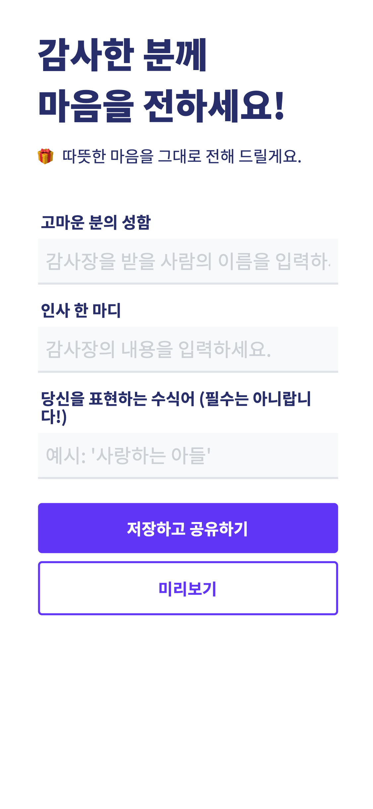
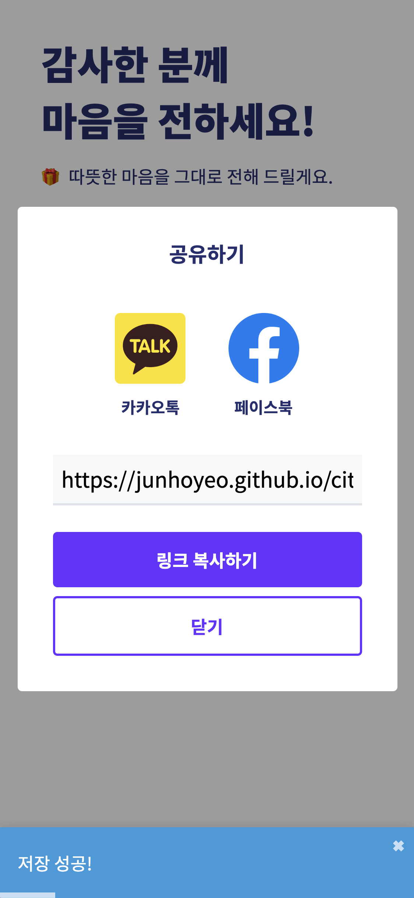
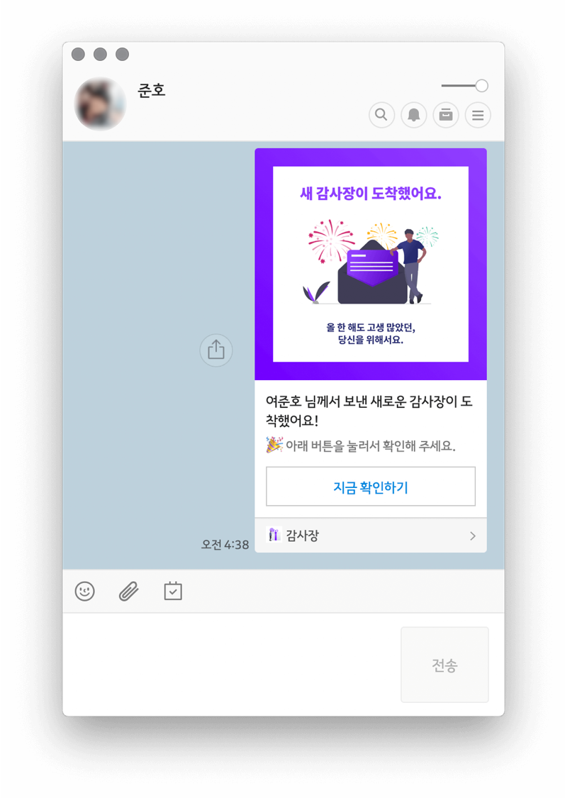

<h1 align="center">새해에는 감사장</h1>

<div align="center">
  <a href="https://junhoyeo.github.io/citation">
    
  </a>
</div>

## 👋 Screens



> 감사장을 생성하고, 공유할 수 있습니다.

## 🎁 Share
> 카카오톡 링크와 페이스북 URL 게시글로 감사장을 나눌 수 있어요.

### Kakaotalk으로 링크 공유하기

1. [카카오 개발자](https://developers.kakao.com/docs/js/getting-started#1-%EC%95%B1%EC%9D%84-%EB%93%B1%EB%A1%9D%ED%95%A9%EB%8B%88%EB%8B%A4-)에서 새로운 애플리케이션과 플랫폼을 등록하고, `JavaScript API 키`를 얻습니다.
2. `public/index.html`에 Kakao SDK CDN을 추가합니다([코드](https://github.com/junhoyeo/citation/blob/master/public/index.html#L20)).
3. [코드](https://github.com/junhoyeo/citation/blob/master/src/utils/share.ts#L03-L36)

```typescript
// SDK를 typescript에서 자유롭게 사용하기 위한 임시 declaration
declare const Kakao: any;

// initializeKakaotalk은 SDK 초기화를 위해 한 번만 호출되어야 합니다.
export const initializeKakaotalk = () => {
  Kakao.init('YOUR_API_KEY');
};

export const shareWithKakaotalk = (shareLink: string, shareName: string): void => {
  Kakao.Link.createDefaultButton({
    container: '#kakao-share-button',
    objectType: 'feed',
    content: {
      title: `${shareName} 님께서 보낸 새로운 감사장이 도착했어요!`,
      description: '🎉 아래 버튼을 눌러서 확인해 주세요.',
      imageUrl: 'https://raw.githubusercontent.com/junhoyeo/citation/master/src/assets/images/kakaotalk.png',
      link: { mobileWebUrl: shareLink, webUrl: shareLink },
    },
    buttons: [
      {
        title: '지금 확인하기',
        link: { mobileWebUrl: shareLink, webUrl: shareLink },
      },
    ],
  });
};
```

- `initializeKakaotalk` 함수를 여러 번 호출하게 되면 에러가 발생하니, `ReactDOM.render`가 있는 `index` 또는 `Router` 등의 애플리케이션 루트에서 호출할 수 있게 합니다.

- `shareWithKakaotalk`을 실행하게 되면 현재 로그인된 카카오톡 계정의 친구와 채팅방에 공유할 수 있는 창이 열립니다.



> 보낸 메세지는 위처럼 표시됩니다.

### Facebook으로 URL 공유하기
> 복잡한 절차 없이 Facebook의 `sharer.php`를 이용해 URL을 공유하는 방법입니다.

1. `public/index.html`에 `og:title`, `og:image` 등 메타데이터를 추가합니다.
2. 본 프로젝트는 [spa-github-pages](https://github.com/rafrex/spa-github-pages)([한국어 번역](https://github.com/sujinleeme/spa-github-pages-ko))의 스크립트를 사용해 Github Pages 상에서 `BrowserRouter` SPA 앱을 구현하므로, `public/404.html`에도 메타데이터를 추가했습니다.
3. [코드](https://github.com/junhoyeo/citation/blob/master/src/utils/share.ts#L40-L41)

```typescript
// 공유할 URL의 쿼리를 문자열 템플릿을 이용해 빌딩합니다.
const shareURL = `https://www.facebook.com/sharer.php?u=${shareLink}&t=${shareTitle}`;

// 적절한 사이즈로 보이게 열어 줍니다.
window.open(shareURL, '', 'width=500,height=500,left=600');
```


> 공유된 URL은 위처럼 보입니다.
